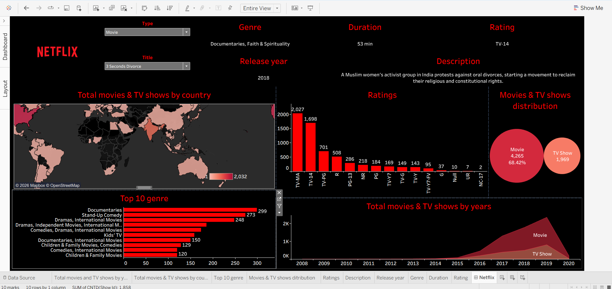

# 🎬 Netflix Movies & TV Shows Analysis (Tableau Dashboard)

## 📌 Project Overview
This project analyzes Netflix Movies and TV Shows dataset using Tableau to uncover key insights related to content distribution, ratings, genres, and growth trends.

The dashboard provides an interactive view of Netflix content across different countries, years, and categories.

---

## 📊 Dataset Information
The dataset contains information about Netflix content including:

- Cast (Actors involved)
- Country (Production country)
- Date Added (When content was added to Netflix)
- Release Year
- Rating (TV-MA, PG-13, etc.)
- Duration (Minutes / Seasons)
- Genre (Listed_in)
- Description

---

## 📈 Key Insights

- 📊 Majority of content on Netflix is Movies (~68%) compared to TV Shows (~32%)
- 🌍 Content is widely distributed across countries, with strong presence in the US and international markets
- ⭐ Most common ratings are TV-MA and TV-14, indicating mature audience focus
- 📅 Significant growth observed after 2015 in content addition
- 🎭 Top genres include Documentaries, Stand-Up Comedy, and Dramas

---

## 📊 Dashboard Features

- 🌍 Country-wise content distribution (Map)
- ⭐ Ratings distribution analysis (Bar Chart)
- 🎭 Top 10 genres visualization
- 📈 Year-wise growth trend (Area Chart)
- 🎬 Movies vs TV Shows distribution (Bubble Chart)
- 🔍 Interactive filters (Movie/TV selection)

---

## 🛠 Tools & Technologies Used

- Tableau (Dashboard & Visualization)
- Data Analysis
- Data Cleaning & Transformation

---

## 📷 Dashboard Preview

---

## 🔗 Project Links

- 📁 GitHub Repository: https://github.com/Mrgajendrasingh/target-brazil-ecommerce-analysis
- 🌐 Tableau Public: [(https://public.tableau.com/views/Netflix_proj1/Netflix?:language=en-US&publish=yes&:sid=&:redirect=auth&:display_count=n&:origin=viz_share_link)](https://public.tableau.com/shared/982WC2B5C?:display_count=n&:origin=viz_share_link)

---

## 🎯 Business Impact

This dashboard helps in:

- Understanding content strategy of Netflix
- Identifying audience targeting trends
- Analyzing growth in content over time
- Supporting data-driven decision making for content platforms

